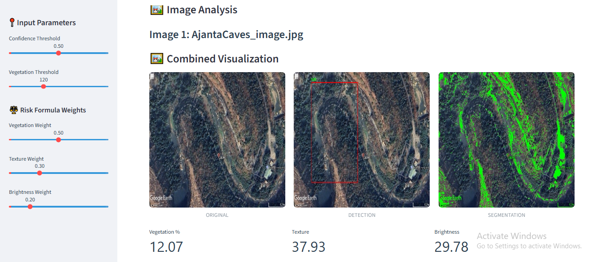
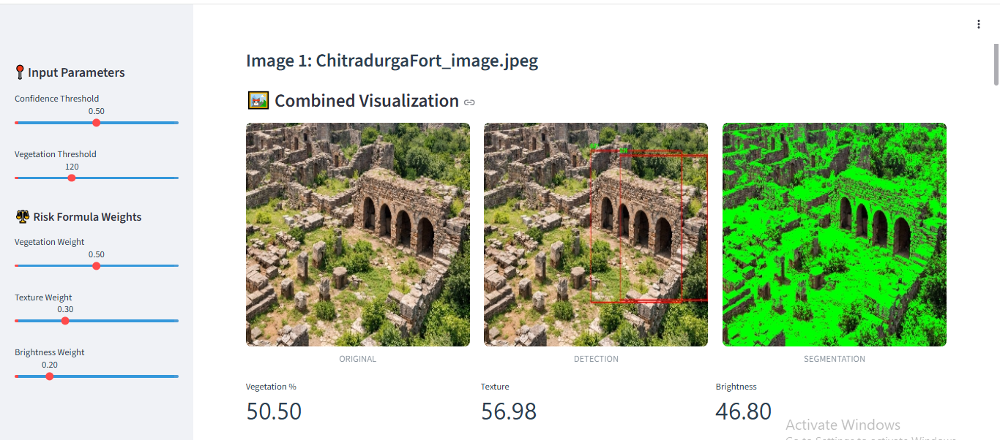
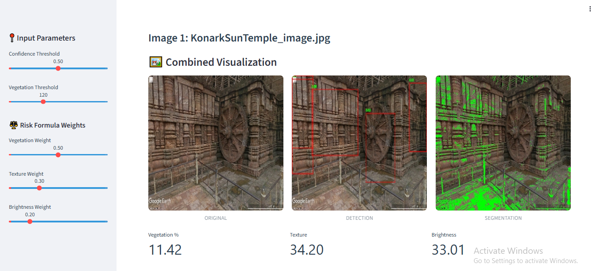

# AI-Based Archaeological Site Mapping and Erosion Risk Analysis System

---

##  Introduction

This project is an AI-powered archaeological intelligence system designed to analyze satellite images and detect erosion risk in archaeological sites. The system integrates computer vision, deep learning, explainable AI, and geospatial analysis to provide automated and interpretable predictions.

The main objective is to assist researchers and archaeologists in identifying vulnerable areas that may be affected by environmental degradation or soil erosion.
Archaeological sites are valuable cultural assets that are increasingly threatened by natural processes. With the advancement of artificial intelligence and satellite imaging technologies, it is now possible to 
automate the detection and analysis of such sites.

This project aims to develop an intelligent system that leverages computer vision and machine learning to analyze satellite images and assess terrain risk.

    
---

##  Problem Statement

Archaeological sites are continuously exposed to natural and human-induced changes such as vegetation loss, soil erosion, and surface degradation. Manual inspection of such large-scale satellite imagery is time-consuming, expensive, and often inaccurate.

Therefore, an automated AI-based system is required to analyze images efficiently and generate risk predictions.

## Why this system is needed?

Archaeological sites are often affected by:

- Soil erosion
- Vegetation loss
- Environmental changes
Manual monitoring is slow and expensive, so AI is used for automation.
---

## Technologies Used

This system is built using the following technologies:

- Python for backend processing  
- Streamlit for interactive web interface  
- YOLOv8 for object detection  
- OpenCV for image processing  
- NumPy and Pandas for computation and data handling  
- Plotly for visualization  
- SHAP for explainable AI  
- FPDF for report generation  

Each tool plays a specific role in ensuring efficient image analysis and interpretation.

---

##  Input Data

The system accepts satellite images in formats such as JPG and PNG. Additionally, a ground truth CSV file can be used for evaluation, containing image names, risk labels, and geospatial coordinates.

These inputs form the base for analysis and prediction.
Users upload satellite images using Streamlit.

### Code used:

```text
uploaded_files = st.file_uploader(...)
```

---

##  System Workflow

The system begins by allowing users to upload satellite images through a Streamlit interface. These images are then processed using a YOLOv8 model to detect relevant terrain features and objects.

After detection, vegetation analysis is performed using color-based segmentation. The green channel thresholding technique is applied to identify vegetation coverage, which is a key indicator of soil stability.

Once segmentation is completed, key features are extracted from each image, including vegetation percentage, texture variation, and brightness levels. These features represent environmental characteristics of the terrain.

A weighted risk formula is then applied to compute an erosion risk score. Vegetation has the highest influence, followed by texture and brightness. Based on the final score, the image is classified into low, moderate, or high-risk categories.

Finally, the results are visualized using charts, heatmaps, and a combined image output that displays original, detection, and segmentation results together.

```text
[ Image Upload ]
        ↓
[ YOLOv8 Detection ]
        ↓
[ Vegetation Segmentation ]
        ↓
[ Feature Extraction ]
        ↓
[ Risk Score Calculation ]
        ↓
[ Risk Classification ]
        ↓
[ Terrain Heatmap ]
        ↓
[ Geospatial Risk Mapping ]
        ↓
[ Visualization + PDF Report ]
```
---

##  Feature Extraction

The system extracts three primary features:

### 1. Vegetation Percentage
Represents the proportion of green pixels in the image. Higher vegetation indicates lower erosion risk.
### Code used: 
```text
veg_ratio = np.mean(vegetation_mask)
```
Measures green coverage
Range: 0 → 1
High vegetation = low risk

### 2. Texture
Measured using the standard deviation of grayscale pixel intensity. It represents surface roughness.
### Code used:
```text
texture = np.std(gray)
```
Measures variation in pixels
High texture = rough terrain

### 3. Brightness
Represents average pixel intensity and indicates surface exposure.
### Code used:
```text
brightness = np.mean(gray)
```
Indicates dryness
Higher brightness = more erosion risk

Example: AjantaCaves_image.jpg
* Vegetation percentage:	12.07%
* Texture:	37.93
* Brightness:	29.78

These features are essential for calculating the final risk score.

---

##  Risk Calculation Formula

It predicts the erosion prone areas by used the model which is XGBoost 
The erosion risk is calculated using a weighted formula:

Risk Score =
(1 - Vegetation) × vegetation_weight +
(Texture / 100) × texture_weight +
(Brightness / 255) × brightness_weight

Example: Default Weights:-
* Vegetation Weight = 0.50
* Texture Weight = 0.30
* Brightness Weight = 0.20

### Why weights matter?
* Vegetation is most important → highest weight
* Texture supports terrain instability
* Brightness adds environmental dryness factor
This formula ensures that vegetation has the highest impact on risk prediction, followed by texture and brightness.

---

#  Risk Classification

Based on computed risk score, classification is performed as:

* High Risk: Score > 0.6  
* Moderate Risk: 0.35 – 0.6  
* Low Risk: < 0.35  

This classification helps in identifying vulnerable archaeological zones.

---

#  YOLOv8 Object Detection

YOLOv8 is used to detect features in satellite images efficiently. It is a real-time object detection model known for its high accuracy and speed.

It helps in identifying relevant structures and terrain variations in images that contribute to risk analysis.
### Loads the model:
* model = YOLO("yolov8_model.pt")
* results = model(img)[0]
* Deployed weights: runs/detect/train/weights/best.pt
  
---

## Vegetation Segmentation

Vegetation is detected using green channel thresholding. Pixels with high green intensity are classified as vegetation.

This method is efficient for satellite images and helps determine soil stability based on vegetation coverage.
### Loads the model:
* model = U-Net (segmentation-models)
* vegetation_mask = green > veg_threshold
* results = u-net_model.pth

* High green intensity = vegetation
* Threshold controls sensitivity
### Parameter Used:
* Default vegetation threshold = 120
* Confidence threshold = 0.50
* Adjustable via slider (50–255)

### Why this method is used:
* Computationally efficient
* Works well on satellite imagery
* No need for additional training models

Vegetation mapping plays a key role in risk analysis.

---

## Visualization Techniques

The system uses multiple visualization methods:

### 1. Bar charts: 
   Shows Feature comparison per image.
Shows by:
  px.bar(features_df) 
### 2. Radar charts:
  Shows Feature influence analysis   
### 3. Gauge charts: 
  Shows Risk score representation  
### 4. Heatmaps: 
  Shows Spatial risk distribution  

All visualizations are dynamically generated using Plotly and Streamlit for interactive analysis.

---

# What-If Simulation
### Purpose:
What-if simulation allows interactive modification of vegetation values to observe changes in risk score dynamically.
To test how risk changes when vegetation changes.

### How it works:
* A slider modifies vegetation percentage
* Risk score is recalculated instantly
* Comparison is shown between original and modified values

### Importance:
* Helps understand model sensitivity
* Provides scenario-based analysis
* Improves interpretability of AI system
* Useful for decision-making in field research

### Code used:
 ```text
 Slider: sim_veg = st.slider(...)
 Risk Calculation: sim_score = erosion_risk_model(...)
```

---

#  Explainable AI (SHAP)

SHAP (SHapley Additive exPlanations) is used to explain model predictions. It shows how each feature contributes to the final risk score.
SHAP is used as an explainability tool to interpret feature contributions toward risk prediction.
Features analyzed in SHAP include vegetation, texture, brightness, edge density, and contrast.

### Model:
shap.KernelExplainer()
### Output:
Feature contribution per image
Positive vs negative impact

### Why SHAP is important:
- Provides transparency in AI decisions
- Shows feature contribution
- Builds trust in model predictions
- Helps validate results scientifically

This improves transparency and trust in the AI system.

---

##  Geospatial Mapping

The system plots risk scores on a map using latitude and longitude values. This helps in identifying geographical distribution of high-risk areas.

Geospatial visualization is important for real-world archaeological field planning. It predicts risk-based color coding.

### Applications:
- Identifying high-risk archaeological areas
- Spatial distribution analysis
- Field survey planning

Geospatial mapping connects AI predictions with real-world locations.

---

##  Model Evaluation Metrics

The system is evaluated using:

- IoU (Intersection over Union)  
- Dice Score  
- RMSE (Root Mean Square Error)  
- R² Score  
- Accuracy  

These metrics ensure the reliability and performance of the model.

---

## PDF Report Generation

A PDF report is generated for each image containing:

- Extracted features  
- Risk score  
- Risk category

### Why use of PDF reports:
- Offline documentation
- Academic reporting
- Easy sharing with researchers

This allows offline documentation and reporting for research purposes.

---


## Generated Outputs

The system generates:

- Processed images with annotations  
- Terrain metrics CSV file  
- PDF reports  
- SHAP explanation plots  
- Risk heatmaps  

These outputs support analysis and reporting.

---

## Conclusion

This AI-based archaeological intelligence system provides an automated, accurate, and explainable approach for detecting erosion risk in satellite images.

It integrates deep learning, image processing, and explainable AI to assist researchers in preserving archaeological sites efficiently and effectively.

The system reduces manual effort and improves decision-making through data-driven insights and also bridges the gap between remote sensing, artificial intelligence, and archaeological conservation.

---

##  Visual Outputs

### Image Screenshots





---
 
## Future Scope
### Real-Time Satellite Integration
- Connect the system with live satellite data sources like Google Earth Pro or OpenAerial Imagery
- Enable continuous monitoring of archaeological sites in real time
- Automatically detect environmental changes over time

### Time-Series Change Detection
- Compare images over years/months
- Detect:
    - Erosion progression
    - Vegetation changes
    - Human damage or encroachment

### GIS Integration
- Integrate with Geographic Information Systems (GIS)
- Overlay predictions on real maps
- Useful for government and archaeological departments

---

## End of Report
