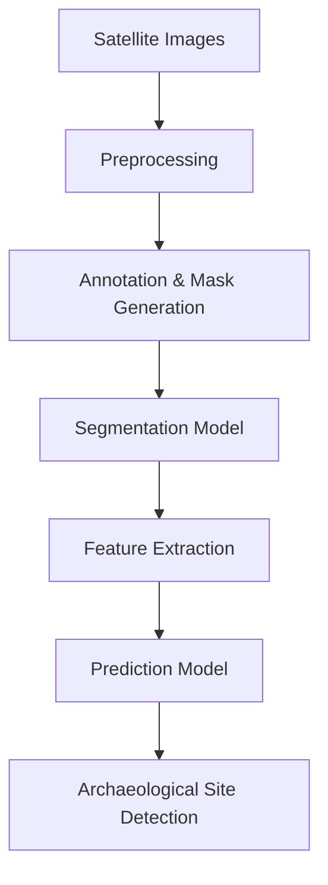

# 🚀 AI-Driven Archaeological Site Mapping

> 🔍 Leveraging Artificial Intelligence & Remote Sensing to Discover Hidden Archaeological Sites

---

## 📌 Overview

Archaeological exploration traditionally relies on manual surveys, which are time-consuming, expensive, and limited by accessibility. This project presents an **AI-driven system** that automates the detection of potential archaeological sites using satellite imagery and machine learning.

By combining **Computer Vision, Remote Sensing, and Predictive Modeling**, the system identifies patterns such as terrain variations, vegetation anomalies, and structural remnants that may indicate buried archaeological sites.

---

## 🎯 Problem Statement

* Manual archaeological surveys are:

  * ⏳ Time-consuming
  * 💰 Expensive
  * 🚧 Limited by terrain accessibility

* There is a need for:

  * Automated detection systems
  * Scalable analysis over large regions
  * Faster and more accurate identification

---

## 💡 Solution

This project proposes an **AI-powered pipeline** that:

1. Collects satellite or aerial imagery
2. Preprocesses and structures the data
3. Applies deep learning models for detection and segmentation
4. Extracts meaningful features
5. Predicts potential archaeological locations

---

## 🚀 Key Features

* 🔍 AI-based archaeological site detection
* 🌍 Remote sensing data analysis
* 🧠 Image segmentation & object detection
* 📊 Predictive modeling using machine learning
* ⚡ Scalable and efficient system
* ⏱️ Reduces manual effort and exploration time

---

## 🧠 Tech Stack

### 👨‍💻 Programming & Tools

* Python
* Google Colab
* OpenCV
* NumPy

### 🤖 AI / ML Models

* YOLO (Object Detection)
* DeepLabV3+ / U-Net (Segmentation)
* XGBoost (Prediction)

### 🌍 Data Sources

* Satellite imagery
* Remote sensing datasets

---

## ⚙️ System Workflow



---

## 📊 Results & Impact

* ✅ Improved detection using AI models
* ⚡ Faster identification of potential excavation sites
* 📉 Reduced dependency on manual surveys
* 🌍 Scalable for large geographical areas

---

## 🛠️ Installation & Setup

```bash
# Clone the repository
git clone https://github.com/springboardmentor787-stack/AIDriven-Archaeological-Site-Mapping.git

# Navigate to project folder
cd AIDriven-Archaeological-Site-Mapping

# Install dependencies
pip install -r requirements.txt

# Run the project
python main.py
```

---

## 📈 Future Enhancements

* 🚀 Integration with real-time satellite APIs
* 🗺️ GIS-based visualization dashboard
* 📦 Deployment as a web application
* 🌐 Multi-spectral image analysis
* 📊 Improved model accuracy with larger datasets

---

## 🌟 Why This Project Stands Out

* Combines **AI + Geospatial Intelligence**
* Solves a **real-world problem in archaeology**
* Demonstrates **end-to-end ML pipeline**
* Uses **advanced models (YOLO, DeepLab, XGBoost)**
* Shows strong **interdisciplinary innovation**

---

## 📄 License

This project is developed for educational and research purposes.

---

## ⭐ Support

If you found this project useful:

* ⭐ Star the repository
* 🍴 Fork it
* 🔗 Share it

---
